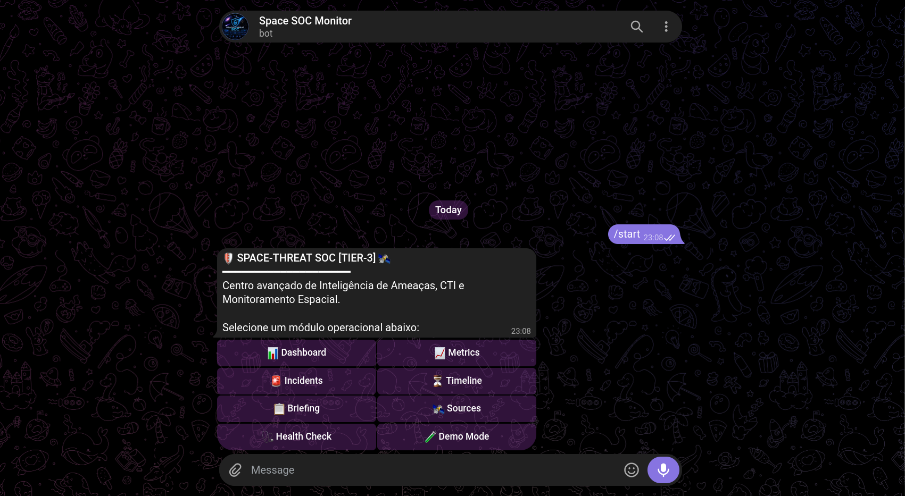

# 🛰️ Space-Threat SOC



> Centro de Monitoramento Experimental combinando Cyber Threat Intelligence (CTI), Segurança da Informação e Monitoramento Espacial.

---

## 🏗️ Arquitetura do Sistema (Diagrama)

O fluxo operacional separa claramente a ingestão de fontes públicas, o motor de correlação e a interface de entrega via Telegram:

```mermaid
graph TD
    A[Fontes Públicas: NASA NeoWS, APOD, NVD] -->|HTTPS / API REST| B[Collectors & Normalizers]
    B --> C[Motor de Correlação & Risk Score]
    C --> D[Audit Logger & Cache em Memória]
    D --> E[Bot do Telegram - Telegraf Engine]
    E -->|Menus Interativos & Alertas| F[Analista SOC / Operador]
    
    subgraph "Camada de Dados"
        G[(Dados Reais - APIs)]
        H[(Dados Calculados - Engine)]
        I[(Dados Simulados - Demo)]
    end
    
    C -.-> G
    C -.-> H
    C -.-> I
