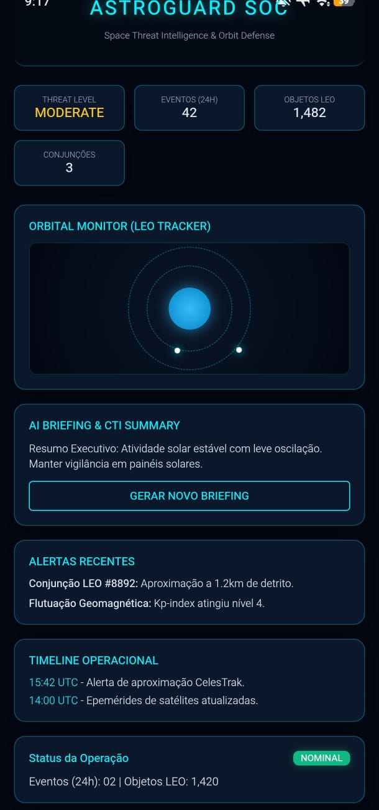
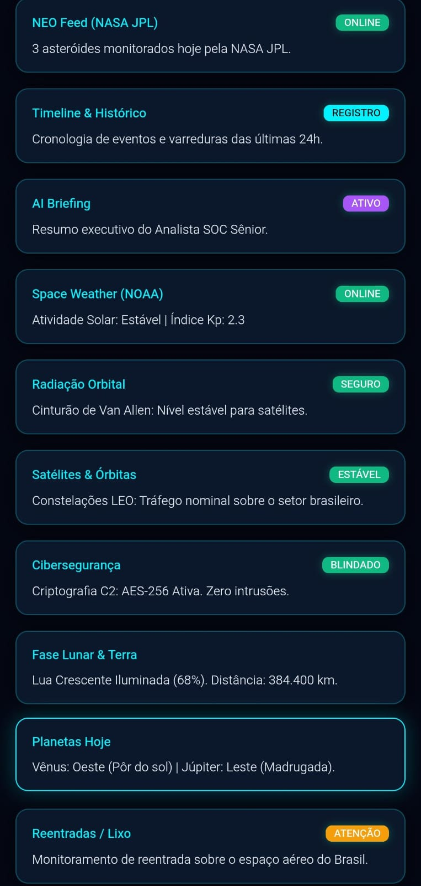
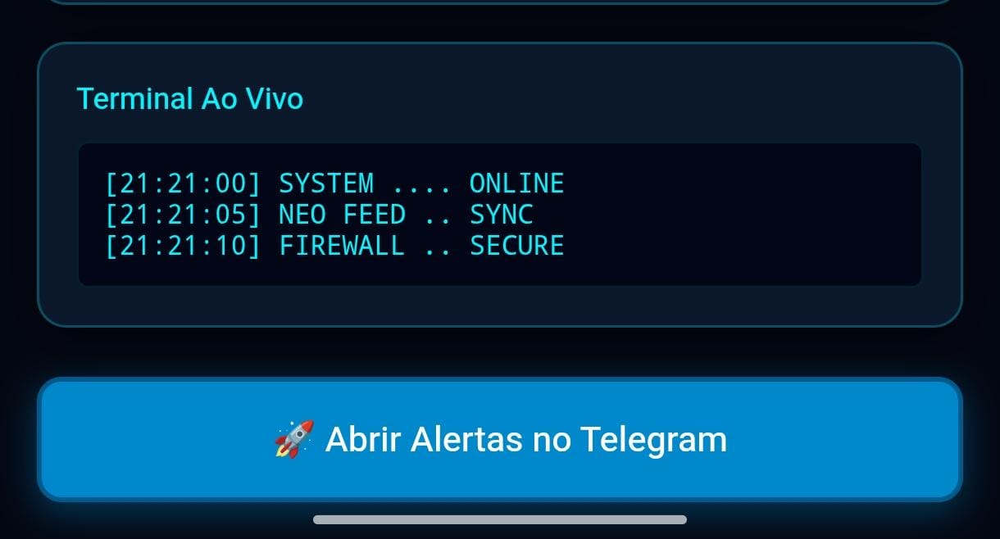

## 📱 Arquitetura do Projeto e Interfaces

O **Space-Threat SOC** é composto por um backend central (Railway), um bot interativo no Telegram e um aplicativo mobile nativo (Android Studio).

### 🖼️ Visão Geral dos Módulos:

| 🤖 Módulo Central (Bot Telegram) | 📱 Interface Mobile (Tela Principal) |
| :---: | :---: |
|  |  |
| *Visão do Bot de SOC em Tier-3 com menus de operações (Dashboard, Incidentes, etc).* | *Painel de controle mobile exibindo Threat Level e resumo de CTI/AI.* |

| 📡 Detalhes Orbitais & Espaciais | 🔗 Atalho de Integração |
| :---: | :---: |
|  |  |
| *Monitoramento técnico (NOAA, NASA/JPL, Radiação, Cibersegurança).* | *Botão de ação rápida para abrir os alertas em tempo real no chat do Telegram.* |
